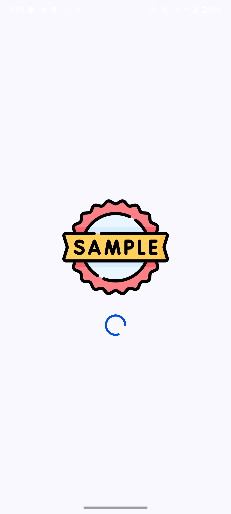
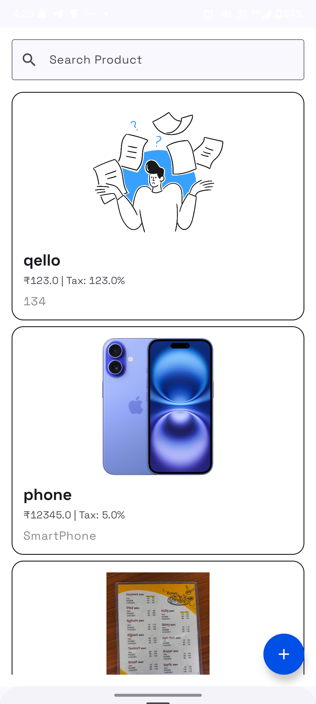
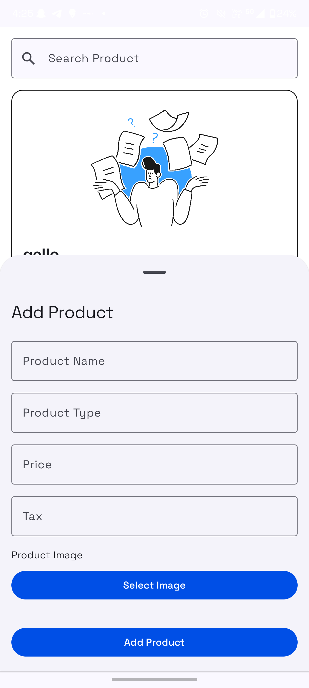

# Swipe Assignment Project

## Overview

The Swipe Assignment app is an offline-first product management application built using **MVVM architecture**, **Room** for local storage, **Koin** for Dependency Injection, and **Retrofit** for API calls. This application is designed to manage product data by fetching it from an API when the internet is available and retrieving it from the local database when offline.

### Key Features
- **Splash Screen**: Checks internet connectivity. If available, fetches product data from the API; otherwise, shows locally stored products.
- **Floating Action Button (FAB)**: Opens a bottom sheet for adding new products.
- **Offline Support**: Allows adding products when offline, with automatic synchronization to the API when internet access is restored.
- **Data Synchronization**: Syncs products with the API when the device regains internet connectivity.
- **Network Connectivity Monitoring**: Uses **Workers** and **BroadcastReceiver** to monitor internet connection status and trigger actions accordingly.
- **Search Functionality**: Search for products from the homepage.
- **Modern UI Design**: The user interface is built using **Jetpack Compose** for a more declarative, modern UI design approach.

## Screenshots

### Splash Screen


### Home Screen with Product List


### Add Product Bottom Sheet


## Demo Video
[Click here to watch the demo video](screenshots/demo.mp4)

## Prerequisites

Before you begin, ensure that you have the following tools and software installed:

- **Android Studio** (latest version recommended)
- **JDK 8 or higher**
- **Kotlin 1.5+**
- **Android Emulator** or a physical device for testing
- **Active internet connection** (for API calls)

## Setup Instructions

### 1. Clone the Repository

Clone the repository to your local machine:

```bash
git clone https://github.com/yourusername/swipe-assignment.git
```

### 2. Open the Project

- Launch Android Studio.
- Click **Open an existing project** and navigate to the cloned project directory.
- Select the project folder and open it in Android Studio.

### 3. Sync Gradle

- After opening the project, Android Studio will prompt you to sync Gradle files.
- Click **Sync Now** to download all dependencies.

### 4. Build the Project

- After syncing, click **Build > Rebuild Project** to make sure all dependencies are correctly set up and there are no issues in the project.

### 5. Running the Application

#### On an Emulator:
- Open **AVD Manager** (Android Virtual Device).
- Create a new virtual device or use an existing one.
- Start the emulator.
- Click **Run > Run 'app'** to build and launch the app on the emulator.

#### On a Physical Device:
- Connect your Android device via USB.
- Enable **Developer Mode** and **USB Debugging** on your device.
- In Android Studio, select your device from the device dropdown.
- Click **Run > Run 'app'** to build and launch the app on your device.

## Application Flow

### Splash Screen:
- The app checks for internet connectivity.
  - If the internet is available, it fetches product data from the API.
  - If no internet is available, the app retrieves products from the local database.
- If no products are found, the homepage will display a message indicating that no products are available.

### Home Page:
- **Product List**: Displays a list of products either from the API or the local database.
- **Search Functionality**: Allows users to search for products. The list updates dynamically based on the search query.
- If no products are found, a message is displayed.
  
### Floating Action Button (FAB) - Add Product:
- Opens a bottom sheet to add a new product.
  - The form includes fields for product name, type, price, and image.
- If the internet is unavailable, the product is saved locally.
- When the internet is restored, the app automatically uploads the saved products to the API.

### Data Synchronization:
- The app uses a **Worker** to periodically check for internet availability.
- Once the internet is available, the app uploads any saved products to the API and synchronizes the database with the API's data.
  
## Technologies Used
- **MVVM Architecture**: Separates UI from business logic for better maintainability.
- **Room**: Local storage solution for saving product data.
- **Koin**: Dependency Injection library for managing app components.
- **Retrofit**: Used for making API calls and handling HTTP requests.
- **Jetpack Compose**: Declarative UI toolkit for building modern UIs.
- **Worker**: For handling background tasks, such as uploading products when the internet becomes available.
- **BroadcastReceiver**: Monitors network connectivity changes.

## Contributing

To contribute to this project:

1. **Fork the repository** on GitHub.
2. **Create a new branch** for your feature or fix:
    ```bash
    git checkout -b feature/your-feature-name
    ```
3. **Make your changes** and **commit** them:
    ```bash
    git commit -am 'Add new feature'
    ```
4. **Push** your changes to your forked repository:
    ```bash
    git push origin feature/your-feature-name
    ```
5. **Open a pull request** to merge your changes into the main branch.
